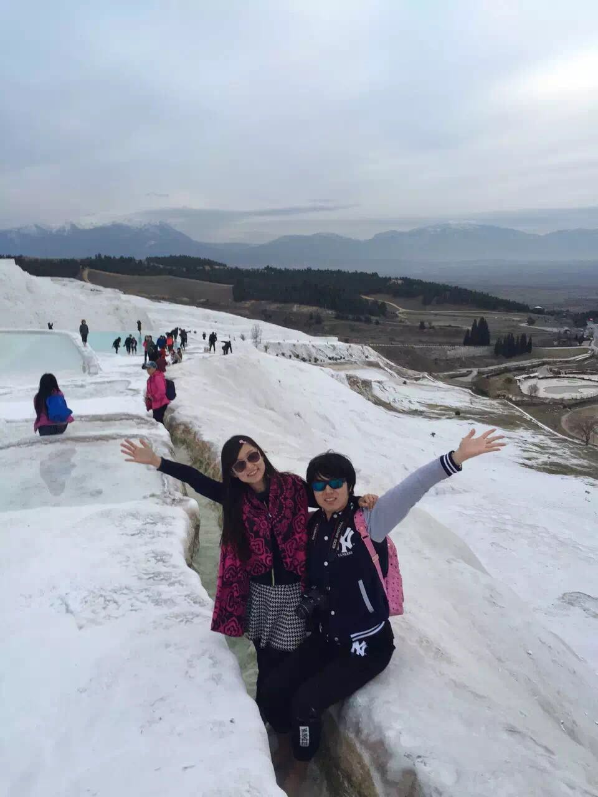
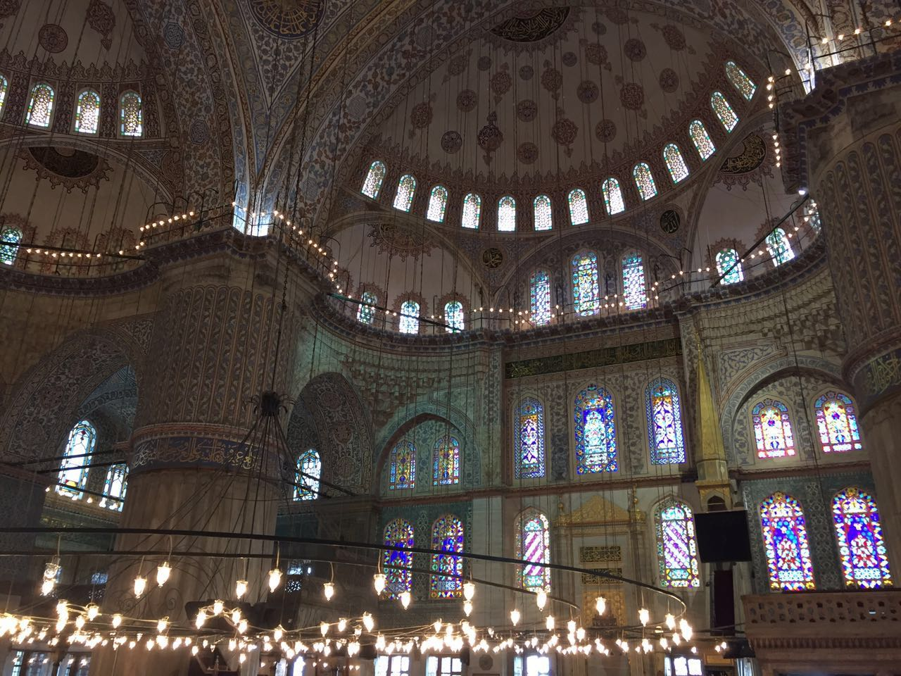

# 我的 2016 年总结

> 在迷惘中坚持，在交流中成长。

## 出游土耳其

2016 年 2 月，我去土耳其游玩了半个月。

即使是我蹩脚的英语，也挡不住土耳其人的热情。

蔚蓝的天空和大海：

形似雪山的棉花堡：

外星地貌的卡帕多奇亚

遍地清真寺的伊斯坦布尔

这里留下了太多回忆。

## 入职微软

之前已经有一个总结贴了：[我来微软这半年](http://blog.xcatliu.com/2016/10/23/half_year_in_microsoft/)，这里就不赘述了。

## GitHub

都说三十不惑，现在我还可以再迷惘几年。

这一年里思考过很多次自己的未来，可是依然没有得到明确的答案。

过去的经验告诉我，当你迷惘的时候，就去做一些有积累的事儿。当你不惑的时候，就是厚积薄发的时候了。

我一直都把 GitHub 当作我的第二个家，看到我的积累慢慢有人认同，是一件非常有成就感的事情。

回顾了一下 2016 年我在 GitHub 上做的事情：

- [加入了 nodejs organization](https://github.com/orgs/nodejs/people?utf8=%E2%9C%93&query=xcatliu)，成为了 [Node.js Website Working Group Collaborators](https://github.com/nodejs/nodejs.org#website-working-group-collaborators) 中的一员
- 在[研究 Bootstrap 4](http://blog.xcatliu.com/2016/01/12/bootstrap_4_preview/) 的时候，给它[提了几个 pr](https://github.com/twbs/bootstrap/issues?utf8=%E2%9C%93&q=author%3Axcatliu%20)
- 加入了 [Microsoft organization](https://github.com/orgs/Microsoft/people?utf8=%E2%9C%93&query=xcatliu)
- 给 live.nodejs.org [加入了多语言支持](https://github.com/nodejs/live.nodejs.org/pull/43)
- 持续更新 [JekyllCN](https://github.com/xcatliu/jekyllcn) 和 [React IE8](https://github.com/xcatliu/react-ie8)
- 给阮一峰的《 ECMAScript 6 入门》[提了十多个 pull request](https://github.com/ruanyf/es6tutorial/pulls?utf8=%E2%9C%93&q=is%3Apr%20author%3Axcatliu%20)
- 开始写一本书[《 From JavaScript to TypeScript 》](https://github.com/xcatliu/from-javascript-to-typescript)
- 写了[几个 Hexo 的插件]( https://www.v2ex.com/t/289667)和[一个 Hexo 的主题]( https://www.v2ex.com/t/288151)
- 开源了 [Mobi.css]( https://github.com/xcatliu/mobi.css)，一个轻量灵活的移动端 CSS 框架。并[在 7 天内获得了 600 个 Stars]( https://www.v2ex.com/t/304129)
- 做了个 Markdown 编辑器[码字 md](http://mazimd.com)
- 给 SimpleMDE [添加了主题系统](https://github.com/xcatliu/simplemde-theme-base)
- 产生了[各种各样稀奇古怪的点子](https://github.com/open-创意-club/创意)

持续的贡献，也让我收获了一些 stars 和 follows，慢慢的开始有人叫我大神。

然而，懂的东西越多，就越能看清自己的差距。我离自己心目中的大神还差很多，以后请还是叫我小猫吧 😺

## 博客

2016 年写了 [16 篇博客](http://blog.xcatliu.com/archives/2016/)，平均下来一个月产出 1.3 篇，虽然不多，但是能够一直坚持下来，也是件不容易的事儿。

比较有代表性的有：

- [Learn TypeScript](http://blog.xcatliu.com/2016/01/29/learn_typescript/)，后来孵化为 [From JavaScript to TypeScript](https://github.com/xcatliu/from-javascript-to-typescript)
- [7 天 600 stars， Mobi.css 是如何诞生的](http://blog.xcatliu.com/2016/09/05/600_stars_in_7_days/)
- [我来微软这半年](http://blog.xcatliu.com/2016/10/23/half_year_in_microsoft/)

更多可以看[我的博客主页](http://blog.xcatliu.com)。

## 新朋友

一直以来，我都把微信视作私密的聊天工具。

但是结实了一些陌生人之后，让我觉得能够与有共同理想共同爱好的人一起交流，会有更大的进步。

感谢各路大神们愿意与我交朋友 [@Steve Mao](https://github.com/stevemao) [@designer](http://chuangzaoshi.com/) [@代码家](https://github.com/daimajia) [@88250](https://github.com/88250) [@狼叔](https://github.com/i5ting) [@justjavac](https://github.com/justjavac) [@sneezry](https://github.com/sneezry) [@青蛙](https://github.com/xeodou) [@Robert Chang](https://github.com/cht8687) [@Vanessa](https://hacpai.com/member/Vanessa) [@小爝](https://github.com/xiaojue) [@芋头](https://github.com/xinyu198736) [@子骅](https://github.com/luin)

## 2017 年展望

经历了很多次制定目标后又无法完成，我渐渐明白，自己是一个不善于规划，而依赖于灵感的人。

经常一个灵感来了，就渐渐偏离了之前规划的道路。

所以这次，我给自己一个自由，看看 2017 年能创造怎样的精彩。
